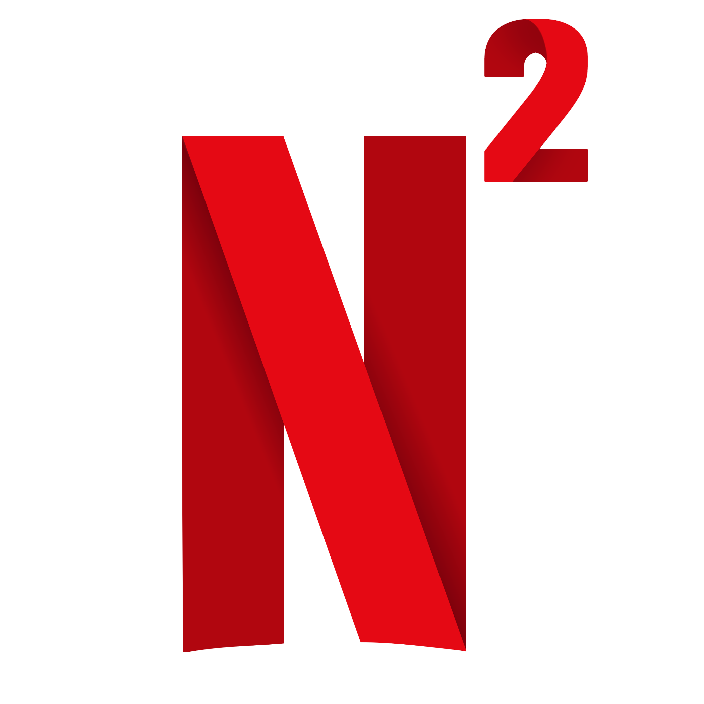

<p align="center"><a href="#"></a></p>

# Netflis

Netflis es una aplicación web creada con el fin de simular o ser un prototipo enfocada al concepto de Big Data. Esta app muestra una lista de películas populares utilizando la API de TMDB y permite a los usuarios guardar películas en su lista de intereses para posteriormente ser procesadas por un modelo Machine Learning que sugerirá películas en base a sus gustos con el dataset (ya incluido en el proyecto) utilizado para entrenarlo.

## Características

- Listado de películas populares con información como título, descripción y póster (obtenido de la API TMDB).
- Funcionalidad para buscar películas por nombre.
- Posibilidad de guardar películas en una lista de intereses.
- Ver Tendencias entre los Usuarios.
- Ver estadísticas propias del usuario y a nivel global.
- Notificaciones visuales con SweetAlert para confirmar acciones del usuario.

## Requisitos previos

Antes de comenzar, asegúrate de tener instalados los siguientes componentes:

- PHP >= 8.0
- Composer
- Node.js y npm
- Python >= 3.8
- Flask y bibliotecas necesarias para Machine Learning
- MongoDB (De preferencia en este proyecto) o cualquier base de datos compatible con Laravel
- Servidor web como Apache o Nginx
- **Clave de API de TMDB** (puedes obtenerla registrándote en [TMDB](https://www.themoviedb.org/))

## Instalación

Sigue estos pasos para configurar el proyecto en tu entorno local:

1. Clona este repositorio:
   ```bash
   git clone https://github.com/tu-usuario/netflis.git
   cd netflis
   ```

2. Instala las dependencias de PHP:
    ```bash
    composer install
    ```

3. Instala las dependencias de Node.js:
    ```bash
    npm install
    ```

4. Instala las dependencias de Python (asegúrate de tener un entorno virtual configurado):
    ```bash
    pip install -r requirements.txt
    ```

5. Copia el archivo de configuración de ejemplo y configura tus credenciales:
    ```bash
    cp .env.example .env
    ```

Edita el archivo `.env` para configurar la conexión a tu base de datos y agrega tu clave de API de TMDB:
   ```
   TMDB_API_KEY=tu_clave_de_api
   ```

6. Genera la clave de la aplicación:
    ```bash
    php artisan key:generate
    ```

7. Ejecuta las migraciones para crear las tablas en la base de datos:
    ```bash
    php artisan migrate
    ```

8. Opcional: Si necesitas datos iniciales, ejecuta los seeders:
    ```bash
    php artisan db:seed
    ```

9. Compila los assets front-end:
    ```bash
    npm run dev
    ```

10. Inicia el servidor de desarrollo:
    ```bash
    php artisan serve
    ```

11. Inicia el servidor Flask para las peticiones de Machine Learning:
    ```bash
    uvicorn api:app --host 0.0.0.0 --port 5000 --reload
    ```

La aplicación estará disponible en http://localhost:8000.

## Uso
- Accede a la página principal para ver las películas populares (datos obtenidos de la API TMDB).
- Haz clic en el botón "Me Interesa" para guardar una película en tu lista de intereses.
- Usa la barra de búsqueda para encontrar películas específicas.
- Entra a la sección "Mis Intereses" para ver el funcionamiento del ML.
- Entra a la sección "Intereses Globales" para ver tendencias entre los usuarios.
- Entra a la sección "Estadisticas" para ver estadísticas claves.

## Tecnologías utilizadas
- Backend: Laravel, Flask
- Frontend: Blade, TailwindCSS, jQuery, SweetAlert
- Base de datos: MongoDB
- Machine Learning: Python, Flask
- **API externa:** TMDB (The Movie Database)

## Contribuciones
Si deseas contribuir a este proyecto, por favor sigue estos pasos:

- Haz un fork del repositorio.
- Crea una rama para tu funcionalidad o corrección de errores:
- Realiza tus cambios y haz un commit:
- Envía tus cambios al repositorio remoto:
- Abre un Pull Request en este repositorio.

## Licencia
Este proyecto está bajo la licencia MIT.